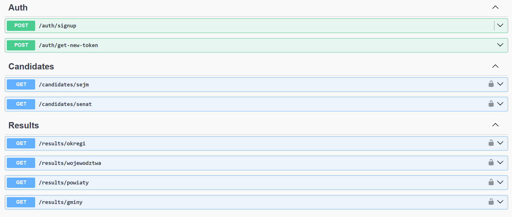

<p align="center">
  <a href="https://nestjs.com/" target="blank"></a>
</p>

[circleci-image]: https://img.shields.io/circleci/build/github/nestjs/nest/master?token=abc123def456
[circleci-url]: https://circleci.com/gh/nestjs/nest

  <p align="center">A progressive <a href="https://nodejs.org" target="_blank">Node.js</a> framework for building efficient and scalable server-side applications.</p>
    <p align="center">
<a href="https://www.npmjs.com/~nestjscore" target="_blank"></a>
<a href="https://www.npmjs.com/~nestjscore" target="_blank"></a>
<a href="https://www.npmjs.com/~nestjscore" target="_blank"></a>
<a href="https://circleci.com/gh/nestjs/nest" target="_blank"></a>
<a href="https://discord.gg/G7Qnnhy" target="_blank"></a>
<a href="https://opencollective.com/nest#backer" target="_blank"></a>
<a href="https://opencollective.com/nest#sponsor" target="_blank"></a>
  <a href="https://paypal.me/kamilmysliwiec" target="_blank"></a>
    <a href="https://opencollective.com/nest#sponsor"  target="_blank"></a>
  <a href="https://twitter.com/nestframework" target="_blank"></a>
</p>

# Poland Elections 2023 REST API

## 🛠️ Stack
- **Nest.js**
- **Node.js**
- **TypeScript**
- **Mongoose**
- **JWT Authentication**

## ✨ Features
1. Access JWT token
2. Access information on individual candidates.
3. Retrieve results of electoral committees in specific districts or territorial units.
4. Use specified filters to select data which you need

## 🚀 Online Access
Experience the API live [here](https://pol-elections2023-rest-api-a30f3cfd5dd3.herokuapp.com).

## 📘 Swagger Documentation
Explore the API using Swagger [here](https://pol-elections2023-rest-api-a30f3cfd5dd3.herokuapp.com/api).



## ⚙️ Installation
To run the project locally, follow these steps:

```bash
# Clone the repository
git clone https://github.com/bpajor/PolElections2023-rest-api.git

# Navigate to the project folder
cd PolElections2023-rest-api

# Install dependencies
npm install

```

Now you should change the start:dev value in package.json to 
```json
SET URI=[Uri you can access from mongodb]&&nest start
```

```bash
# Start server
npm run start:dev
```

## 🌟 Additional Information
This project leverages the powerful Nest.js framework, ensuring scalability and maintainability. The integration of JWT authentication ensures secure access to election data, while TypeScript enhances code readability and maintainability.

Feel free to contribute to the project and help make election data accessible and understandable for everyone.

For any issues or suggestions, please create an [issue](#https://github.com/bpajor/PolElections2023-rest-api/issues).

Happy coding! 🚀

## 📜 License
This project is licensed under the MIT License.

